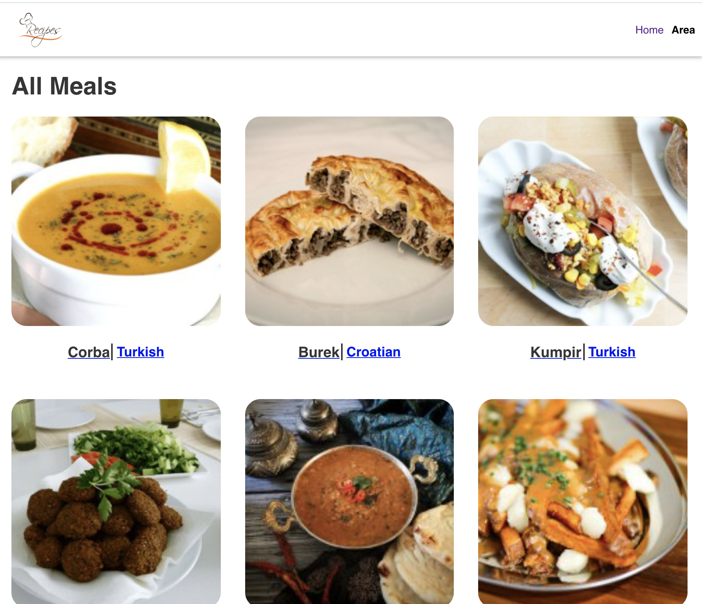

# Food Recipe App

## About

This project implements a simple food recipe SPA with data gotten from the test API of themealdb.com. The project is divided into two main sections:

## Home Section:

    Returns all meals with name and meal area.

##### Some functionalities

- search meal using the search bar
- view meal details(recipe) by selecting a meal.

## Category section:

    Returns All categories

- The main functionality is to filter meals by categories

### Home page

### Meal Detail page

## Built With

- React

# Setup

[Clone App](https://github.com/nganifaith/React-Food-Recipe/).

- cd to React-Food-Recipe
- run `npm install`
- run `git checkout feature`
- run `npm start` app opens on [http://localhost:3000](http://localhost:3000)

## Test

- run test `npm test`

### Prerequisites

- Knownledge of React
- JS API calls
- Redux
- React styled-components
- React Router

## Live site

[Live](https://fervent-sinoussi-2ae78f.netlify.app/)

## Author

👤 **Ngani Faith**

- GitHub: [@nganifaith](https://github.com/nganifaith)
- Twitter: [@Bright_Ngani](https://twitter.com/bright_ngani)
- LinkedIn: [Ngani Faith](https://www.linkedin.com/in/ngani-faith/)

## 🤝 Contributing

Contributions, issues, and feature requests are welcome!

Feel free to check the [issues page](https://github.com/nganifaith/React-Food-Recipe/issues).

## Show your support

Give a ⭐️ if you like this project!

## 📝 License
